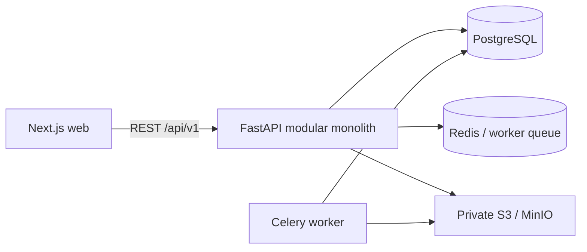

# Architecture

Every company is a tenant with its own in-memory store and `tenant_id` on every persisted row. Signup creates a tenant; login, invites, and password resets bind the request to that tenant before any read or write. Alembic owns the schema (`apps/api/alembic`); the API still calls `create_all` for empty local databases.
