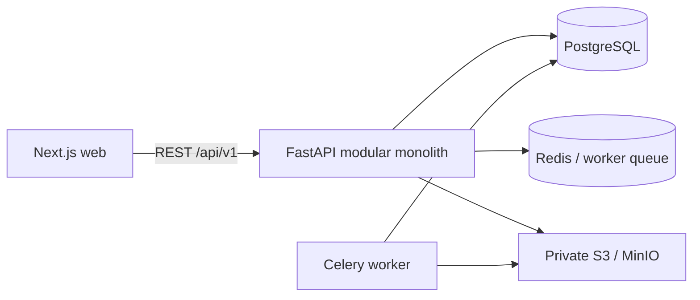

# Architecture

Production repositories implement tenant-scoped SQLAlchemy persistence, with every mutation inside a unit of work and audit/outbox record. API routers remain thin; attendance, requests, approvals, and payroll calculations are application use cases with pure domain rules.
