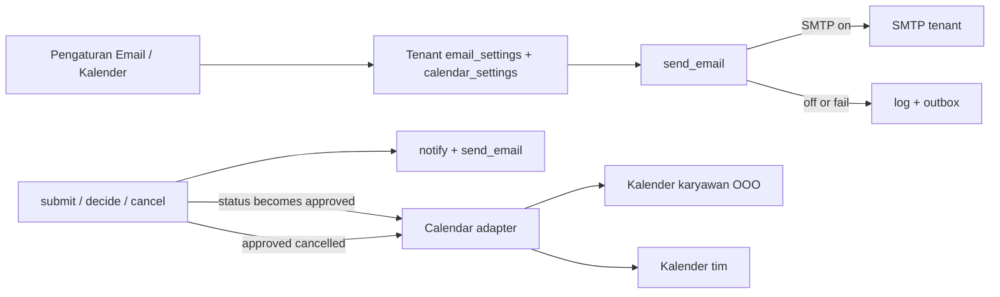
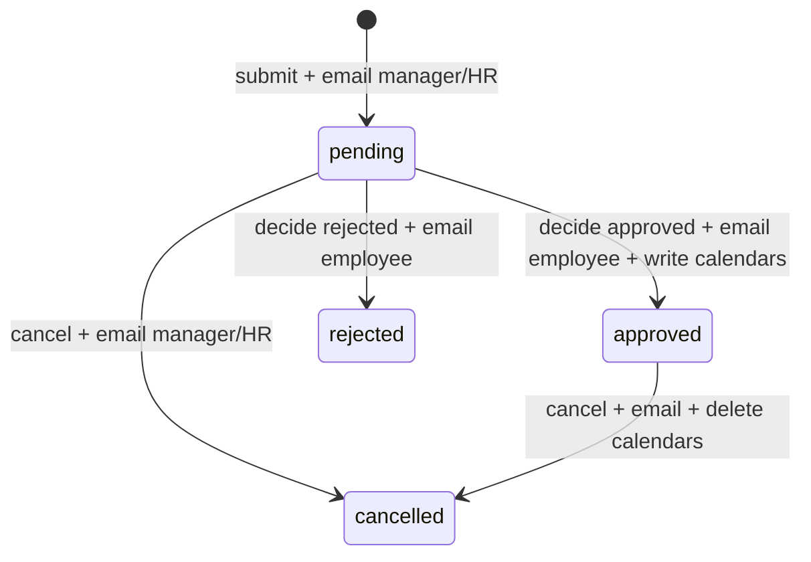

# feat: Tenant email settings, leave emails, and calendar sync

## Summary

Tambah panel Email di Pengaturan, hidupkan SMTP di belakang `send_email`, kirim email pada siklus cuti, lalu setelah approve tulis Out of Office karyawan dan event kalender tim ke Microsoft 365 atau Google.

## Problem Frame

`send_email` hanya menulis log dan outbox. Leave hanya `notify()` in-app. Manager yang tidak membuka Teamku melewatkan pengajuan, dan tim tidak melihat siapa yang off di kalender kerja. (see origin: `docs/brainstorms/2026-09-07-leave-email-calendar-requirements.md`)

## Requirements

Trace ke origin.

- R1. HR mengatur SMTP tenant dari `/app/settings`, terpisah dari `OfficeLocation`.
- R2. Field: enabled, from-name, from-address, host, port, username, password, encryption.
- R3. GET tidak mengembalikan password; UI menandai password sudah tersimpan.
- R4. Tombol kirim email uji ke alamat HR.
- R5. Tanpa SMTP, perilaku lama (log/outbox) tetap; cuti tidak error.
- R6. Submit cuti: email + inbox ke manager departemen dan HR Admin aktif.
- R7. Approve/reject: email + inbox ke pemohon.
- R8. Cancel pending: email ke manager/HR. Cancel approved: email ke pemohon, manager, HR.
- R9. Email ID, teks polos, tautan `/app/approvals` atau `/app/time/time-off`.
- R10. Approve menulis OOO karyawan + event kalender tim.
- R11. Satu provider per tenant, admin consent, bukan OAuth per karyawan.
- R12. Satu kalender bersama perusahaan di v1.
- R13. Cancel/ubah tanggal approved menghapus atau mengganti kedua event.
- R14. Pending/reject tidak membuat event.
- R15. Gagal sync tidak mengubah status cuti; status sync terlihat.

## Key Technical Decisions

| Decision | Choice | Rationale |
|---|---|---|
| Settings surface | Tabel/store `email_settings` baru, bukan kolom di `office_settings` | Office table adalah kebijakan geofence/alert. SMTP secrets jangan campur di situ. Pola GET any-auth / PUT `hr_admin` tetap sama. |
| Mailer seam | Pertahankan `send_email(to, subject, body)` | Invite, reset, dan attendance alerts sudah memanggilnya. Tes memakai `outbox` / `last_email_to`. |
| SMTP source | Tenant settings dulu; jika disabled atau kosong, fallback log+outbox | Runbook sudah minta wire SMTP; `MOVON_SMTP_*` tidak diperlukan di v1. |
| Leave email recipients | Submit/cancel-pending: dept managers + all active `hr_admin`. Decide: employee. Cancel-approved: employee + dept managers + HR | `notify()` submit hari ini hanya manager dept. Email menambah HR karena HR bisa approve semua. |
| Calendar timing | Hanya saat transisi ke `approved`, dan saat approved di-cancel/diubah | Origin: jangan buat event pending. |
| Calendar write | Sinkron di request approve/cancel, gagal-aman | Redis/Celery ada di arsitektur, tidak di kode. Jangan blokir approval. |
| Provider model | Satu enum `microsoft` \| `google` per tenant + admin OAuth | Campur provider = OAuth per user; ditunda. |
| Event title | `Cuti · {name}` all-day; reason tidak ikut | Privacy untuk A4 (tim). |
| Event ids | Simpan `employee_calendar_event_id` dan `team_calendar_event_id` di leave request | Perlu untuk hapus/ganti tanpa search. |
| Secrets | Password SMTP dan refresh token tidak pernah di response. Field `password_set` / `connected` boolean | Encryption-at-rest ditunda; jangan echo. |

## High-Level Technical Design

Approval tetap commit dulu. Calendar adapter dipanggil sesudahnya. Kegagalan mengisi `calendar_sync_status=failed` tanpa rollback.

## Scope Boundaries

**In scope**

- Panel Email + API + persistensi + email uji
- SMTP di `send_email` (invite/reset/alert ikut hidup)
- Email siklus cuti
- Panel Kalender + admin consent + tulis/hapus event

**Deferred to Follow-Up Work**

- Encrypt SMTP password at rest
- Kalender per departemen
- OAuth per karyawan / mixed Google+M365
- Sync dua arah
- Worker/Celery untuk retry kalender
- UI “siapa cuti hari ini” di Teamku

**Out of scope**

- Teamku sebagai klien kalender penuh
- Agenda check-in ke kalender
- Invite all-hands

## Implementation Units

### U1. Tenant email settings model and API

**Goal:** HR bisa membaca dan menyimpan konfigurasi SMTP per tenant tanpa melihat password.

**Requirements:** R1, R2, R3

**Dependencies:** none

**Files:**
- `apps/api/src/movon_hr/modules/api.py`
- `apps/api/src/movon_hr/core/persistence.py`
- `apps/api/alembic/versions/0003_email_and_calendar_settings.py`
- `apps/api/tests/test_email_settings.py`

**Approach:** Dataclass `EmailSettings` di store, sejajar `OfficeLocation`. GET `/settings/email` untuk user terautentikasi (payload publik, `password_set` boolean). PUT `/settings/email` `hr_admin` only; password opsional — kosong berarti pertahankan yang lama. Jangan masukkan password ke `office_payload`.

**Patterns to follow:** `GET/PUT /settings/office`, `require(user, "hr_admin")`, persist via snapshot + Alembic column/table baru.

**Test scenarios:**
- Happy path: HR PUT host/port/from, GET mengembalikan field itu dan `password_set=false` sampai password dikirim.
- Happy path: PUT password sekali, GET berikutnya `password_set=true` dan tidak ada field password.
- Edge: PUT tanpa password tidak menghapus password tersimpan.
- Error: employee PUT → 403.
- Integration: setelah PUT, `save_store` / `load_store` mempertahankan host dan `password_set`.

**Verification:** Tes di atas lulus. Password tidak muncul di JSON GET.

### U2. SMTP-backed mailer

**Goal:** `send_email` mengirim lewat SMTP tenant jika enabled; jika tidak, perilaku log+outbox lama.

**Requirements:** R5

**Dependencies:** U1

**Files:**
- `apps/api/src/movon_hr/core/mailer.py`
- `apps/api/tests/test_mailer_smtp.py`
- `apps/api/tests/test_tenancy_auth.py` (undang/reset masih mengisi outbox saat SMTP off)

**Approach:** `send_email` tetap signature-nya. Baca `store` email settings di dalam fungsi atau lewat hook yang di-inject. SMTP gagal: log exception, tetap append outbox, jangan raise ke caller. Tambah `POST /settings/email/test` yang memanggil `send_email` ke email HR yang login.

**Patterns to follow:** `last_email_to` / `outbox` di tes undangan. `emit_attendance_alert` sudah memanggil `send_email` tanpa try — mailer harus menelan error SMTP.

**Test scenarios:**
- Happy path: SMTP off → outbox bertambah, tidak ada koneksi jaringan.
- Happy path: SMTP on + transport palsu sukses → outbox tetap terisi untuk tes, from-address dari settings.
- Error: transport raise → caller `send_email` tidak raise; outbox tetap ada.
- Integration: `POST /settings/email/test` sebagai HR mengirim ke `user.email`; employee → 403.
- Covers AE1: submit cuti tanpa SMTP tidak 500 (boleh menunggu U4; di U2 cukup panggil `send_email` langsung).

**Verification:** Tes undangan existing tetap hijau. Tes mailer baru hijau.

### U3. Email settings UI

**Goal:** HR mengisi SMTP dan menguji kiriman dari Pengaturan.

**Requirements:** R1, R2, R3, R4

**Dependencies:** U1, U2

**Files:**
- `apps/web/src/app/app/settings/page.tsx`
- `apps/web/src/app/globals.css` (hanya jika panel baru butuh spacing yang sudah dipakai `settings-panel`)

**Approach:** Artikel baru di bawah panel yang ada, pola `location-consent` + `form-grid` + `Simpan` terpisah (seperti re-verifikasi). Password input kosong dengan hint “tersimpan” jika `password_set`. Tombol “Kirim email uji”.

**Patterns to follow:** Panel re-verifikasi di halaman yang sama; HR-only gate yang sudah ada.

**Test expectation:** none — tidak ada harness UI. Verifikasi manual: buka `/app/settings` sebagai HR, simpan, reload, password tidak terlihat, email uji memunculkan dialog sukses/gagal.

**Verification:** Manager diarahkan ke overview. HR melihat panel Email dan bisa save.

### U4. Leave lifecycle emails

**Goal:** Ajukan / putuskan / batalkan cuti mengirim email ke penerima yang benar.

**Requirements:** R6, R7, R8, R9

**Dependencies:** U2

**Files:**
- `apps/api/src/movon_hr/modules/api.py` (`submit_leave`, `decide`, `cancel_leave`)
- `apps/api/tests/test_leave_emails.py`
- `apps/api/tests/test_core_workflows.py` (pastikan approve masih lolos)

**Approach:** Helper `leave_email_recipients` dan `send_leave_email` di samping `notify`. Submit: manager dept + HR Admin aktif, selain pemohon. Decide: pemohon. Cancel: cabang pending vs approved sesuai R8. Jangan biarkan kegagalan email mengubah status. Salin gaya undangan: subjek `Permohonan cuti baru — Teamku`, body ID + `app_url(...)`.

**Patterns to follow:** `submit_leave` notify loop; `emit_attendance_alert` + `send_email`; tes `last_email_to` di `test_tenancy_auth.py`.

**Test scenarios:**
- Covers AE2. Submit Engineering → email ke manager Engineering dan HR; bukan manager Sales.
- Covers AE1. SMTP off + submit → 200, outbox terisi.
- Happy path: approve → email ke pemohon berisi “disetujui” dan tautan time-off.
- Happy path: reject → email ke pemohon berisi “ditolak”.
- Edge: cancel pending → email manager/HR, bukan “keputusan”.
- Edge: cancel approved → email pemohon + manager + HR.
- Integration: `notify` tetap dipanggil seperti sekarang (inbox tidak hilang).

**Verification:** `test_leave_emails.py` dan `test_core_workflows.py` hijau.

### U5. Calendar settings and admin consent

**Goal:** HR memilih provider, menghubungkan tenant, dan menunjuk kalender tim.

**Requirements:** R11, R12

**Dependencies:** U1

**Files:**
- `apps/api/src/movon_hr/modules/api.py`
- `apps/api/src/movon_hr/core/persistence.py`
- `apps/api/alembic/versions/0003_email_and_calendar_settings.py` (lanjutkan revisi yang sama jika U1 belum merge; jika sudah, `0004_...`)
- `apps/web/src/app/app/settings/page.tsx`
- `apps/api/tests/test_calendar_settings.py`

**Approach:** `CalendarSettings`: `provider`, `connected`, `team_calendar_id`, token fields internal. OAuth: redirect HR ke Microsoft identity / Google, callback menyimpan refresh token di store, GET hanya `provider`, `connected`, `team_calendar_id`. Client id/secret aplikasi Teamku boleh `MOVON_MS_CLIENT_ID` / `MOVON_GOOGLE_CLIENT_ID` di process env — itu kredensial app, bukan tenant. Tidak ada tulis event di unit ini.

**Patterns to follow:** Settings HR-only; secrets tidak di GET (sama U1).

**Test scenarios:**
- Happy path: HR PUT provider `microsoft`, GET `connected=false` sampai callback sukses.
- Happy path: callback test doubles menandai `connected=true`.
- Error: employee GET boleh melihat `connected` (read), PUT/callback → 403.
- Error: PUT provider `both` atau string asing → 422.

**Verification:** Tes settings kalender hijau. UI menampilkan status terhubung / belum.

### U6. Calendar write on approve and delete on cancel

**Goal:** Approve membuat dua event; cancel approved menghapusnya; gagal sync tidak mengubah cuti.

**Requirements:** R10, R13, R14, R15

**Dependencies:** U4, U5

**Files:**
- `apps/api/src/movon_hr/modules/api.py` (`decide`, `cancel_leave`, adapter hook)
- `apps/api/src/movon_hr/core/calendar.py` (baru; adapter microsoft/google + fake untuk tes)
- `apps/api/src/movon_hr/core/persistence.py` (kolom event id + sync status di `leave_requests`)
- `apps/api/alembic/versions/` (kolom di revisi 0003 atau 0004)
- `apps/api/tests/test_leave_calendar.py`

**Approach:** Adapter dengan `create_ooo(employee_email, start, end, title)`, `create_team_event(calendar_id, ...)`, `delete_event(...)`. `decide` approved: persist status dulu, lalu adapter; simpan kedua id; `calendar_sync_status=ok|failed`. Pending/reject: tidak panggil adapter. Cancel approved: hapus kedua id jika ada. Provider belum connected: `skipped`, bukan error user. POST `/settings/calendar/retry/{request_id}` untuk AE6.

**Patterns to follow:** Approval ACL yang sudah ada. Gagal-aman seperti persist middleware di `main.py`.

**Test scenarios:**
- Covers AE3. Submit saja → adapter tidak dipanggil.
- Covers AE4. Approve dengan adapter palsu → dua create, judul `Cuti · {name}`, status ok, ids tersimpan.
- Covers AE5. Cancel approved → dua delete.
- Covers AE6. Adapter raise → status cuti approved, `calendar_sync_status=failed`.
- Edge: approve saat `connected=false` → skipped, 200.
- Error: reject → nol create.

**Verification:** Tes kalender hijau. Approval existing tetap 200 meski adapter down.

## Phased Delivery

1. U1 → U2 → U3 — email benar-benar terkirim (termasuk undangan yang sudah ada).
2. U4 — cuti memakai saluran itu.
3. U5 → U6 — blok kalender setelah approve.

Jangan kerjakan U6 sebelum U4 dan U5. U3 boleh paralel dengan U4 setelah U2.

## System-Wide Impact

- `send_email` menjadi I/O sungguhan. Semua pemanggil (invite, forgot-password, attendance alert) ikut SMTP tenant.
- Approval latency naik sebesar dua panggilan kalender. Tetap sinkron; jangan rollback domain.
- Token OAuth dan password SMTP adalah secrets baru. Jangan log body settings. Runbook: update “wire SMTP” menjadi “isi Pengaturan → Email”.
- Privacy: judul kalender tanpa alasan. Email manager/HR boleh memuat alasan.

## Risks & Dependencies

| Risk | Mitigation |
|---|---|
| SMTP salah → undangan produksi gagal | Email uji wajib sebelum toggle dianggap andal; fallback outbox tetap ada |
| Admin consent ditolak / scope kurang | UI `connected=false`; approve tetap sukses (`skipped`) |
| Email karyawan di luar tenant M365/Google | Create OOO gagal → `failed` + retry; jangan anggap semua domain match |
| Snapshot persistence + secrets | Password hanya di baris tenant; GET mask; audit `settings.email_updated` tanpa nilai secret |
| Belum ada worker | Retry manual dulu; Celery follow-up |

**Dependencies:** akun app Microsoft/Google (client id/secret) di env deploy. Bukan blocker U1–U4.

## Open Questions

- Client id Microsoft vs Google untuk environment Movon — isi saat U5, bukan U1.
- Apakah HR Movon punya shared mailbox/kalender yang bisa dipakai sebagai kalender tim? Asumsi v1: ya, HR menempelkan id-nya.

## Sources & Research

- Repo briefing: settings office pattern, mailer outbox, leave notify-only, no Celery. [Repo research](1eb97450-66a9-4345-9914-44c0985fb578)
- `docs/runbook.md` — SMTP belum di-wire.
- `docs/architecture.md` — Alembic owns schema; worker digambarkan tetapi tidak diimplementasi.
- Origin: `docs/brainstorms/2026-09-07-leave-email-calendar-requirements.md`
- `docs/solutions/` tidak ada; tidak ada institutional learning.
