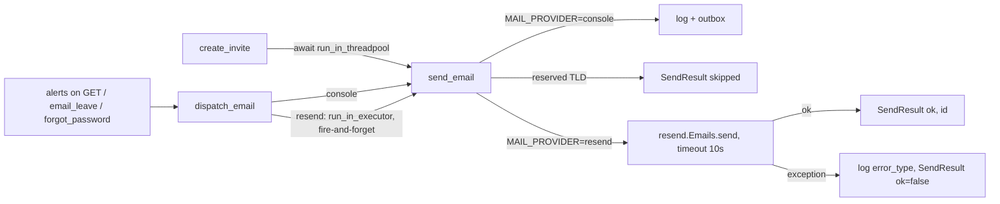

# feat: Send transactional email through Resend

## Summary

Hidupkan `send_email` lewat Resend (free tier, development) supaya tombol "Undang via email" benar-benar mengirim email. Satu akun Resend global lewat env, pengirim `Teamku <noreply@movoncreative.dev>`. Semua pemanggil `send_email` (undangan, reset password, alert presensi, email cuti) ikut lewat Resend begitu provider aktif.

## Problem Frame

`send_email` hanya menaruh pesan di `outbox` in-memory dan `logger.info` (`apps/api/src/movon_hr/core/mailer.py:31-35`). `POST /invites` tetap 200 dan web menampilkan "Undangan terkirim", padahal tidak ada email yang keluar. Tidak ada SMTP server. (see origin: `docs/research/2026-09-25-001-resend-email-invite.md` §1.3–1.4)

## Requirements

- R1. `MOVON_MAIL_PROVIDER=resend` mengirim semua email lewat Resend. Default `console` = perilaku lama (log + outbox), tanpa jaringan.
- R2. Provider `resend` tanpa API key atau `from` gagal saat startup, bukan saat kirim.
- R3. `send_email` tidak pernah raise ke pemanggil. Gagal kirim dicatat di log tanpa body/token.
- R4. Undangan tetap tersimpan meski email gagal. Response `POST /invites` memuat `email_status: "sent" | "failed"` dan tetap memuat `invite_url`.
- R5. Web membedakan "Undangan terkirim" vs "Undangan dibuat, email gagal terkirim" dan tetap menampilkan tautan.
- R6. Email tetap teks polos (body yang ada sekarang). HTML ditunda.
- R7. Build produksi (`apps/api/Dockerfile`) memasang SDK `resend`.
- R8. Tes existing yang memakai `outbox` / `last_email_to` tetap hijau, dan test suite tidak pernah memanggil Resend meski `.env` lokal berisi `MOVON_MAIL_PROVIDER=resend`.
- R9. Alamat di TLD reserved (`.test`, `.example`, `.invalid`, `.localhost`, mis. data demo `@movon.test`) tidak dikirim ke Resend.
- R10. Di luar `environment=development`, log tidak pernah memuat body email (token undangan/reset).
- R11. Request GET dan `forgot-password` tidak menunggu panggilan Resend.

## Key Technical Decisions

| Decision | Choice | Rationale |
|---|---|---|
| Provider | Resend Python SDK `resend>=2.47,<3`, API key global di env | Keputusan tim: Resend free tier untuk development. SMTP tidak ada. |
| Pengirim | `Teamku <noreply@movoncreative.dev>` (root domain, sudah verified; DKIM, SPF `send.`, dan DMARC `p=none` + laporan Cloudflare sudah aktif per 2026-09-25) | Keputusan 2026-09-25. Pindah ke `teamku.movoncreative.dev` sebelum produksi cukup ganti `MOVON_MAIL_FROM`. |
| Cakupan | Semua pemanggil `send_email`, tanpa allowlist per jenis email | Masih development; jangan dibatasi. |
| Nama env | `MOVON_RESEND_API_KEY`, `MOVON_MAIL_PROVIDER`, `MOVON_MAIL_FROM` | Semua config lewat `Settings` (`env_prefix="MOVON_"`, `core/settings.py:6`). `resend.api_key` di-set eksplisit dari `Settings`, bukan dari `RESEND_API_KEY`. |
| Mailer seam | Pertahankan `send_email(to, subject, body)`, tambah keyword opsional `kind`; return `SendResult`. Tambah `dispatch_email(...)` (fire-and-forget) dengan argumen yang sama | Pemanggil existing tetap jalan. Selaras dengan plan 2026-09-07 (`plan:44,146`). |
| Kapan menunggu Resend | Hanya `create_invite` yang menunggu hasil (`await run_in_threadpool(send_email, ...)`), karena butuh `email_status`. Alert presensi, email cuti, dan forgot-password memakai `dispatch_email` | `evaluate_attendance_alerts()` jalan di `GET /notifications` dan `GET /attendance/today` (`api.py:1979,2402`) dan bisa mengirim ke semua karyawan aktif dalam satu request (`api.py:987-997`). Forgot-password yang menunggu Resend hanya untuk email terdaftar membocorkan keberadaan akun lewat waktu respons (`api.py:1482-1506`). |
| `dispatch_email` | Provider `console`: panggil `send_email` langsung (tanpa I/O, tes tetap deterministik). Provider `resend`: `asyncio.get_running_loop().run_in_executor(None, send_email, ...)`; tanpa loop berjalan → sinkron | Pemanggilnya fungsi sync yang dieksekusi di thread event loop, jadi `get_running_loop()` tersedia. Tidak butuh worker/Celery. `send_email` sudah menelan error, jadi future yang tidak di-await tidak memunculkan exception. |
| Timeout | `resend.RequestsClient(timeout=10)` (default SDK 30 dtk) | < timeout klien web 15 dtk (`apps/web/src/lib/api.ts:15`). SDK sync, tidak perlu extra `resend[async]`. |
| Error handling | Tangkap `Exception` di transport, log `error_type`/`code`, return `SendResult(ok=False)` | 403 domain belum verified jatuh ke `ResendError` generik; timeout jaringan bukan `ResendError`. Mailer tidak boleh raise (plan 2026-09-07 `plan:146,148`). |
| TLD reserved | Transport `resend` mengembalikan `SendResult(ok=False, error="skipped_reserved_domain")` untuk `.test`/`.example`/`.invalid`/`.localhost` tanpa memanggil API | Seed demo (`maya@movon.test`, dst.) ikut di-seed ke DB produksi yang kosong (`main.py:49-51`). Email ke sana bounce, dan bounce > 4% bisa mem-pause akun Resend. |
| Logging | `logging.basicConfig(level=INFO)` di `main.py`. Transport `console` mencetak body hanya jika `settings.environment == "development"`; selain itu hanya `kind` | Saat ini `INFO` kemungkinan tidak tampil (research §1.4). Menyalakannya tanpa redaksi akan menulis token undangan/reset ke log Dokploy selama produksi masih `console`. |
| Isolasi tes | `apps/api/tests/conftest.py` memaksa `settings.mail_provider = "console"` (autouse fixture) | `Settings` membaca `env_file=".env"` (`settings.py:6`) dan belum ada `conftest.py`. |
| Outbox | Hanya transport `console` yang mengisi `outbox` | Di mode `resend` outbox tidak tumbuh tanpa batas. |
| Format | Teks polos saja; body di pemanggil tidak berubah | Paling sederhana untuk development. HTML (string di Python, bukan React Email yang hanya untuk Node SDK) ditunda. |
| Idempotency key | Tidak dipakai di scope ini | Tidak ada retry otomatis. Dipakai nanti saat ada "kirim ulang undangan". |
| Gagal kirim undangan | 200 + `email_status="failed"`, audit `invite.email_failed` | Karyawan baru dibuat saat accept (`api.py:1445-1478`), jadi tidak ada yang di-rollback. Respons 5xx membuat middleware tidak persist store (`main.py:77-93`) padahal undangan sudah di memori. |

## High-Level Technical Design



Sketsa `core/mailer.py` (arah, bukan kode final):

```python
@dataclass
class EmailMessage:
    to: str
    subject: str
    body: str                      # teks polos, kompatibel dengan tes lama
    kind: str = "generic"          # jadi tag Resend
    sent_at: datetime = ...

@dataclass(frozen=True)
class SendResult:
    ok: bool
    provider_id: str | None = None
    error: str | None = None

def send_email(to, subject, body, *, kind="generic") -> SendResult:
    # pilih transport dari settings.mail_provider; tidak pernah raise

def dispatch_email(to, subject, body, *, kind="generic") -> None:
    # console → send_email langsung; resend → run_in_executor tanpa menunggu
```

## Scope Boundaries

**In scope**

- Settings + validasi, dependency, Dockerfile, `.env.example`
- Transport `console` dan `resend`, `dispatch_email`, skip TLD reserved, redaksi log, `conftest.py`
- `email_status` di `POST /invites`, toast web
- Alert presensi, email cuti, dan forgot-password lewat `dispatch_email`
- Env Dokploy + smoke test

**Deferred to Follow-Up Work**

- Pindah pengirim ke subdomain `teamku.movoncreative.dev` (sebelum produksi)
- Persist `alert_receipts` yang ditulis saat request GET (lihat Risks)
- Email HTML (semua jenis email; sekarang teks polos)
- Endpoint "kirim ulang undangan" + idempotency key
- Worker/antrian dengan retry untuk email yang gagal
- Webhook Resend untuk bounce/complaint
- Akun/team Resend terpisah dan plan berbayar untuk produksi

**Out of scope**

- SMTP per tenant dan panel Email di Pengaturan (`docs/plans/2026-09-07-001-feat-leave-email-calendar-plan.md` U1–U3). Seam `send_email` tetap sama, jadi bisa ditambahkan di atasnya nanti.

## Implementation Units

### U1. Settings, dependency, and build

**Goal:** Konfigurasi Resend terbaca dari env dan tervalidasi saat startup; image produksi memasang SDK.

**Requirements:** R1, R2, R7

**Dependencies:** none

**Files:**
- `apps/api/src/movon_hr/core/settings.py`
- `apps/api/pyproject.toml`, `apps/api/uv.lock` (`uv add "resend>=2.47,<3"`)
- `apps/api/Dockerfile` (tambah `"resend>=2.47,<3"` ke `pip install` baris 3)
- `.env.example`
- `apps/api/tests/test_mailer.py` (satu file tes untuk U1–U2)

**Approach:** Tambah field `mail_provider: Literal["console", "resend"] = "console"`, `resend_api_key: SecretStr | None = None`, `mail_from: str | None = None`. Perluas `model_validator` yang ada: jika `mail_provider == "resend"` dan key atau `from` kosong → `ValueError`. `.env.example`: blok komentar seperti Google OAuth, dengan contoh `MOVON_MAIL_FROM=Teamku <noreply@movoncreative.dev>`.

**Patterns to follow:** Field Google OAuth dan `normalize_environment` di `settings.py`.

**Test scenarios:**
- Happy path: tanpa env → `mail_provider == "console"`.
- Happy path: `resend` + key + from → valid; `repr(settings)` tidak memuat key.
- Error: `resend` tanpa key → `ValidationError`. `resend` tanpa from → `ValidationError`.
- Error: provider `smtp` → `ValidationError`.

**Verification:** Tes hijau. `docker build apps/api` sukses dan `python -c "import resend"` jalan di image.

### U2. Resend transport in the mailer

**Goal:** `send_email` mengirim lewat Resend saat provider `resend`, tidak pernah raise, tidak mengirim ke TLD reserved, tidak membocorkan token ke log, dan tes tidak pernah menyentuh jaringan.

**Requirements:** R1, R3, R8, R9, R10

**Dependencies:** U1

**Files:**
- `apps/api/src/movon_hr/core/mailer.py`
- `apps/api/src/movon_hr/main.py` (konfigurasi logging)
- `apps/api/tests/conftest.py` (baru)
- `apps/api/tests/test_mailer.py`

**Approach:**
- `send_email(to, subject, body, *, kind="generic") -> SendResult`. Pilih transport dari `settings.mail_provider` saat dipanggil (tes bisa monkeypatch settings).
- `console`: `outbox.append`, return `SendResult(ok=True)`. Log: body lengkap hanya jika `settings.environment == "development"`; selain itu hanya `Email queued kind=%s`.
- `resend`:
  - TLD reserved → `SendResult(ok=False, error="skipped_reserved_domain")`, log `info`, tanpa panggilan API.
  - Set `resend.api_key` dari `settings.resend_api_key.get_secret_value()` dan `resend.default_http_client = resend.RequestsClient(timeout=10)` sekali saat pertama dipakai.
  - Kirim `{"from": settings.mail_from, "to": [to], "subject", "text": body, "tags": [{"name": "kind", "value": kind}]}`. Sukses: `logger.info("Email sent kind=%s id=%s", ...)`. Gagal: tangkap `Exception`, `logger.warning("Email failed kind=%s error=%s", kind, getattr(exc, "error_type", type(exc).__name__))`. Jangan log body atau token.
- `dispatch_email(...) -> None`: provider `console` → `send_email(...)` langsung. Provider `resend` → `asyncio.get_running_loop().run_in_executor(None, functools.partial(send_email, ...))`; `RuntimeError` (tidak ada loop) → `send_email(...)` sinkron.
- `main.py`: `logging.basicConfig(level=logging.INFO)` supaya baris ini muncul di log Dokploy.
- `conftest.py`: autouse fixture `monkeypatch.setattr(settings, "mail_provider", "console")`.
- `outbox`, `reset_outbox`, `last_email_to` tetap ada dan tetap diisi transport `console`.

**Patterns to follow:** Boundary provider di `core/ai_provider.py` (`FakePolicyProvider`, `ProviderError`).

**Test scenarios:**
- Happy path: `console` → outbox bertambah, `SendResult.ok`, tidak ada panggilan `resend`.
- Happy path: `resend` + `resend.Emails.send` di-monkeypatch mengembalikan `{"id": "x"}` → `ok=True`, `provider_id="x"`, params memuat `from`, `to=[...]`, `text`, tag `kind`; outbox tidak bertambah.
- Edge: `resend` + `maya@movon.test` → `error="skipped_reserved_domain"`, fake tidak dipanggil.
- Error: fake raise `resend.exceptions.ResendError`-like (403 `validation_error`) → `ok=False`, tidak raise, log memuat error type, tidak memuat body.
- Error: fake raise `requests.Timeout` → `ok=False`, tidak raise.
- Security: `console` + `environment="production"` → log tidak memuat body/token.
- Integration: `dispatch_email` di mode `console` mengisi outbox secara sinkron; di mode `resend` di dalam loop memanggil `run_in_executor` dan tidak menunggu.
- Integration: dengan `MOVON_MAIL_PROVIDER=resend` di env proses, fixture `conftest.py` tetap membuat tes memakai `console`.
- Integration: tes existing `test_tenancy_auth.py` dan `test_attendance_alerts.py` hijau tanpa perubahan.

**Verification:** `uv run pytest` hijau. `uv run ruff check` bersih.

### U3. Invite delivery status and forgot-password

**Goal:** Response undangan memberi tahu status email; forgot-password tidak menunggu Resend.

**Requirements:** R3, R4, R11

**Dependencies:** U2

**Files:**
- `apps/api/src/movon_hr/modules/api.py` (`create_invite` ~1381-1424, `forgot_password` ~1482-1506)
- `apps/api/tests/test_tenancy_auth.py`

**Approach:**
- `create_invite`: setelah `store.invitations[...] = invitation`, `result = await run_in_threadpool(send_email, email, subject, body, kind="invite")` dengan subject dan body yang sama seperti sekarang (`api.py:1409-1418`). Jika `not result.ok` → `audit("invite.email_failed", user, invitation.email)`. Return tambah `"email_status": "sent" if result.ok else "failed"`.
- `forgot_password`: ganti `send_email` dengan `dispatch_email(..., kind="password_reset")`. Response tetap `{"ok": True}` apa pun hasilnya.

**Patterns to follow:** `audit(...)` dan bentuk response `create_invite` yang ada; `run_in_threadpool` dari `starlette.concurrency`.

**Test scenarios:**
- Happy path: invite (console) → 200, `email_status == "sent"`, `invite_url` ada, `last_email_to(email).body` memuat URL undangan.
- Error: `send_email` di-monkeypatch mengembalikan `SendResult(ok=False)` → 200, `email_status == "failed"`, undangan tetap bisa dibuka via `GET /invites/{token}`, audit `invite.email_failed` tercatat.
- Integration: `test_invite_and_accept_creates_employee_in_same_tenant` dan `test_password_reset_rotates_credentials` tetap hijau.
- Integration: forgot-password memanggil `dispatch_email`, bukan `send_email`, dan tetap `{"ok": True}` untuk email terdaftar maupun tidak.

**Verification:** Tes hijau. Tidak ada perubahan perilaku untuk email yang tidak terdaftar di forgot-password.

### U4. Attendance alert and leave emails off the request path

**Goal:** Email alert presensi dan cuti tidak menahan request, terutama GET yang di-polling.

**Requirements:** R11

**Dependencies:** U2

**Files:**
- `apps/api/src/movon_hr/modules/api.py` (`emit_attendance_alert` ~952-976, `email_leave` ~624-627)
- `apps/api/tests/test_attendance_alerts.py`, `apps/api/tests/test_core_workflows.py`

**Approach:** Ganti `send_email(...)` dengan `dispatch_email(..., kind="attendance_alert")` di `emit_attendance_alert` dan `dispatch_email(..., kind="leave")` di `email_leave`. Tidak ada perubahan logika penerima, receipt, atau `alerts_enabled`.

**Patterns to follow:** Pemanggilan `send_email` yang ada.

**Test scenarios:**
- Integration: `test_attendance_alerts.py:66` (`last_email_to("fresh@movon.test")`) tetap hijau di mode `console`.
- Integration: dengan provider `resend` dan fake `send_email` yang lambat, `GET /notifications` kembali tanpa menunggu fake selesai.
- Integration: submit/approve cuti tetap 200 dan outbox terisi (console).

**Verification:** Tes hijau. Tidak ada `send_email` langsung yang tersisa di handler selain `create_invite`.

### U5. Web toast for email status

**Goal:** HR tahu apakah email benar-benar terkirim, dan tetap punya tautan kalau gagal.

**Requirements:** R5

**Dependencies:** U3

**Files:**
- `apps/web/src/app/app/people/page.tsx` (`invite()` ~76-88)

**Approach:** Tipe response jadi `{invite_url: string; email_status?: "sent" | "failed"}`. `sent` → `notify("success", "Undangan terkirim", "Email undangan dikirim ke <email>.")` plus tautan. `failed` → `notify("info", "Undangan dibuat, email gagal terkirim", "Bagikan tautan ini secara manual: <url>")`. `email_status` absen (API lama) → perilaku sekarang. `NotificationDialog` sudah mendukung `success | error | info` (`apps/web/src/components/NotificationDialog.tsx:6`).

**Patterns to follow:** Pemakaian `notify` yang sudah ada di halaman yang sama.

**Test expectation:** none — tidak ada harness UI. Verifikasi manual di U6.

**Verification:** `npm run build` di `apps/web` sukses; dua cabang toast tampil sesuai status.

### U6. Deploy and smoke test

**Goal:** Email undangan terkirim dari API di Dokploy.

**Requirements:** R1, R7

**Dependencies:** U1–U5 merged ke `main`

**Files:** none (konfigurasi)

**Approach:**
1. Cek/ganti `teamku-dev-api-key` di dashboard Resend menjadi `sending_access` untuk domain `movoncreative.dev` (research §4).
2. Dokploy → service API (`teamku-api-8umq6u`) → Environment, level service. Set **ketiganya sekaligus** dalam satu save: `MOVON_MAIL_PROVIDER=resend`, `MOVON_MAIL_FROM=Teamku <noreply@movoncreative.dev>`, `MOVON_RESEND_API_KEY=<dari dashboard>`. Validator startup (U1) membuat API crash-loop jika salah satu kosong atau salah ketik. Key tidak di-commit dan tidak disalin ke Vercel.
3. Redeploy, lalu cek log startup Dokploy: tidak ada `ValidationError`, `/health` 200.
4. Smoke test: dari web produksi, undang karyawan dengan email tim sendiri (Gmail). Cek email masuk (inbox, bukan spam), Gmail "Show original" menunjukkan DKIM/SPF/DMARC `PASS`, tautan membuka `/invite?token=…` di domain Vercel, log Dokploy memuat `Email sent kind=invite` tanpa token, dan Resend dashboard mencatat `delivered`.
5. Negatif: di lokal, set `MOVON_MAIL_FROM` ke domain yang belum verified → toast "email gagal terkirim" dan log `Email failed`.
6. Pantau Resend dashboard beberapa hari pertama: jumlah kirim harian vs kuota 100, dan bounce rate.

**Verification:** Email undangan diterima dan tautan aktivasi berfungsi end to end.

## Phased Delivery

1. U1 → U2 — transport siap, default tetap `console`, aman di-merge sendiri.
2. U3, U4 — undangan memberi status kirim; email lain keluar dari jalur request.
3. U5 — toast web.
4. U6 — aktifkan di Dokploy. Jangan aktifkan sebelum U4 merge.

U3, U4, dan U5 boleh paralel setelah U2 (U5 cukup menunggu bentuk response U3).

## System-Wide Impact

- Saat `MOVON_MAIL_PROVIDER=resend`, `send_email` jadi I/O jaringan untuk semua pemanggil: undangan, reset password, alert presensi (`api.py:961`), dan email cuti (`api.py:624-627`).
- `evaluate_attendance_alerts()` jalan di setiap `GET /notifications` dan `GET /attendance/today` jika tenant mengaktifkan `alerts_enabled` (default `False`, `api.py:233`). Setelah jam reminder, satu GET bisa memicu email ke semua karyawan aktif yang belum presensi. Dengan U4 email itu tidak menahan request, tapi tetap memakai kuota.
- Kuota free tier 100/hari dihitung per team Resend. Alert presensi dan email cuti memakai kuota yang sama dengan undangan.
- Secret baru: `MOVON_RESEND_API_KEY`. Jangan log settings atau header request.
- `logging.basicConfig(INFO)` membuat log `INFO` aplikasi muncul di Dokploy untuk pertama kalinya. Redaksi di U2 mencegah token ikut tercetak.
- `docs/runbook.md:3` ("wire SMTP before production onboarding") perlu diperbarui menjadi langkah env Resend.

## Risks & Dependencies

| Risk | Mitigation |
|---|---|
| Alert di GET menghabiskan kuota 100/hari (tenant besar + `alerts_enabled`) sehingga undangan gagal | `email_status="failed"` + `invite_url` tetap tampil; pantau dashboard (U6.6); plan berbayar sebelum produksi |
| `alert_receipts` yang ditulis saat GET tidak dipersist (middleware hanya menyimpan request mutasi, `main.py:77-93`), jadi setelah redeploy alert hari yang sama bisa terkirim ulang | Diterima untuk development; follow-up: persist receipt saat alert dikirim |
| Data demo `@movon.test` membuat bounce | Skip TLD reserved di transport (U2) |
| Tes mengirim email sungguhan dari `.env` lokal | `conftest.py` memaksa `console` (U2) |
| Token undangan/reset tercetak di log Dokploy | Redaksi log `console` di luar development (U2); transport `resend` tidak pernah log body |
| Timing forgot-password membocorkan email terdaftar | `dispatch_email` (U3) |
| Env Dokploy tidak lengkap → crash-loop | Set ketiga env sekaligus + cek log startup (U6.2–3) |
| Lupa menambah `resend` di Dockerfile → `ImportError` | U1 mengubah Dockerfile di PR yang sama; verifikasi `docker build` |
| Email dari `dispatch_email` hilang saat proses restart di tengah kirim | Diterima untuk development; follow-up worker dengan retry |
| Scope API key terlalu luas | Ganti dengan key `sending_access` untuk `movoncreative.dev` (U6.1) |
| Bounce tinggi (salah ketik email) mem-pause akun | Webhook bounce di follow-up; pantau dashboard |

**Dependencies:** akses dashboard Resend (API key). DNS email `movoncreative.dev` (DKIM, SPF, DMARC) sudah siap per 2026-09-25.

## Open Questions

- Siapa owner akun Resend, dan apakah produksi nanti memakai team Resend terpisah?

## Sources & Research

- Origin: `docs/research/2026-09-25-001-resend-email-invite.md`
- Plan terkait (SMTP per tenant, di luar scope): `docs/plans/2026-09-07-001-feat-leave-email-calendar-plan.md`
- Resend Python SDK: https://github.com/resend/resend-python (`resend/__init__.py:98-106`, `RequestsClient(timeout=30)` default)
- Resend send email: https://resend.com/docs/send-with-python
